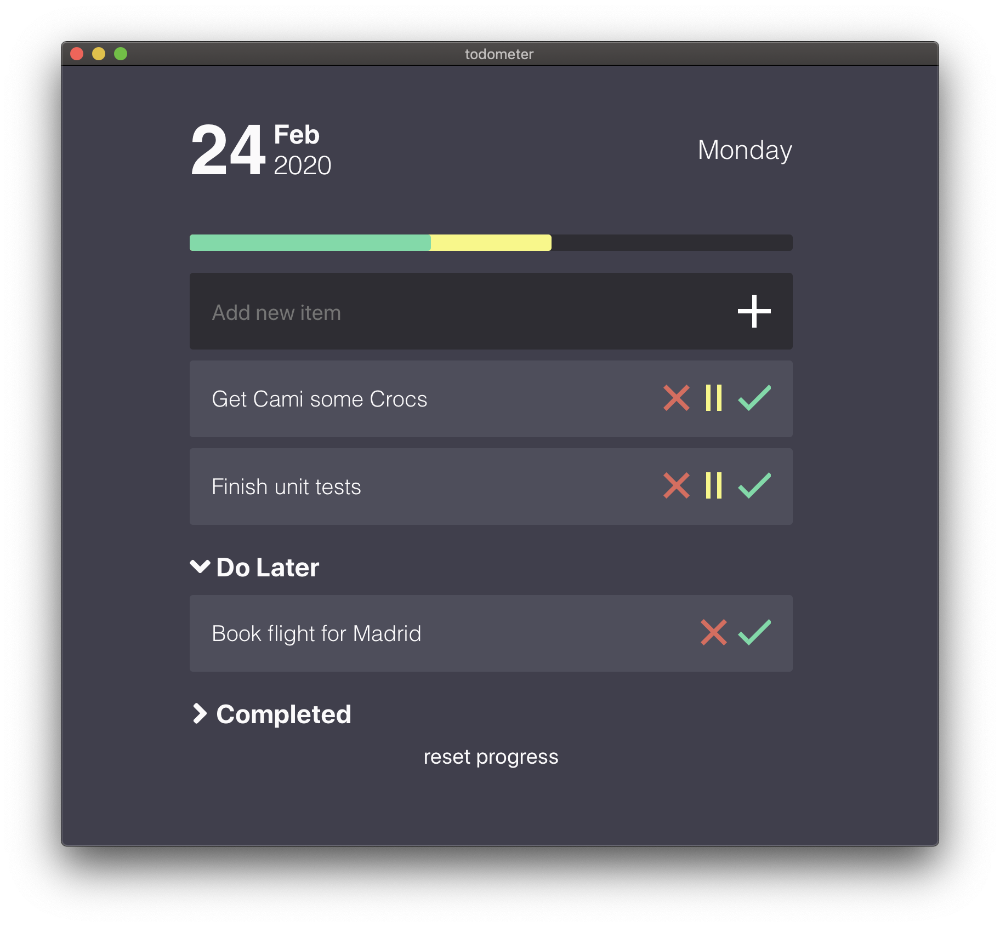

# Productivity Pet Helper 🐾

A gamified productivity app that combines task management with a virtual pet companion to make completing your to-dos more engaging and fun!



## ✨ Features

### 📝 Task Management
- **Simple To-Do List**: Add, complete, pause, and delete tasks
- **Time Limits**: Set time constraints for tasks (0-24 hours)
- **Progress Tracking**: Visual progress meter showing completion status
- **Auto-Failure**: Tasks automatically fail when time expires

### 🐾 Pet Companion System
- **Virtual Pet**: Your personal productivity companion named "Helper"
- **Pet Attributes**: Level, health, coins, mood, and experience
- **Reward System**: Earn coins and experience for completing tasks
- **Health Management**: Pet health decreases when tasks fail

### 🛒 Pet Shop
- **Health Potion**: Restore pet health (+30 health for 50 coins)
- **Super Food**: Boost health and experience (+20 health, +10 exp for 80 coins)
- **Toy**: Improve pet mood (30 coins)
- **Collar**: Increase pet level (+1 level for 100 coins)

### 🎮 Gamification Elements
- **Level System**: Gain levels through experience points
- **Coin Economy**: Earn coins by completing tasks, spend on pet items
- **Mood System**: Pet's mood reflects your productivity success
- **Visual Feedback**: Animated rewards and penalties

## 🚀 Getting Started

### Prerequisites
- Node.js (v16 or higher)
- npm or yarn

### Installation

1. **Clone the repository**:
```bash
git clone https://github.com/hu-yq2005/productivity-pet-helper.git
```

2. **Navigate to the project directory**:
```bash
cd productivity-pet-helper
```

3. **Install dependencies**:
```bash
npm install
```

4. **Start the development server**:
```bash
npm run dev
```

### Building for Production

To create a production build:

```bash
npm run build
npm run electron-pack
```

## 🎯 How It Works

1. **Add Tasks**: Create new to-do items with optional time limits
2. **Complete Tasks**: Mark tasks as done to earn rewards for your pet
3. **Manage Pet**: Keep your pet healthy and happy by completing tasks
4. **Shop for Items**: Use earned coins to buy items that help your pet
5. **Level Up**: Gain experience and level up your pet companion

## 🎨 Pet System Details

### Pet Attributes
- **Name**: "Helper" (your virtual companion)
- **Level**: Increases with experience (100 exp = 1 level)
- **Health**: 0-100, decreases when tasks fail (-15 per failure)
- **Coins**: Earned by completing tasks (+10 per completion)
- **Experience**: Gained by completing tasks (+5 per completion)
- **Mood**: Changes based on task success/failure

### Reward System
- **Task Completion**: +10 coins, +5 experience
- **Task Failure**: -15 health, mood becomes sad
- **Shop Items**: Various effects to restore and improve your pet

## 🛠️ Technology Stack

- **Frontend**: React 18, Vite
- **Desktop App**: Electron
- **Styling**: CSS Modules
- **State Management**: React Context API
- **Data Persistence**: localStorage
- **Date Handling**: date-fns

## 📱 Supported Platforms

- **macOS**: Native app support
- **Windows**: Native app support  
- **Linux**: Native app support

## 🤝 Contributing

Contributions are welcome! Please feel free to submit a Pull Request. For major changes, please open an issue first to discuss what you would like to change.

### Development Guidelines
- Keep the app simple and focused on productivity
- Maintain the gamification elements that make it engaging
- Ensure cross-platform compatibility
- Test thoroughly before submitting

## 📄 License

This project is licensed under the MIT License - see the [LICENSE](LICENSE) file for details.

## 🙏 Acknowledgments

- Built with love for productivity enthusiasts
- Inspired by the need to make task management more engaging
- Special thanks to the React and Electron communities

---

**Make productivity fun with your virtual pet companion!** 🎉